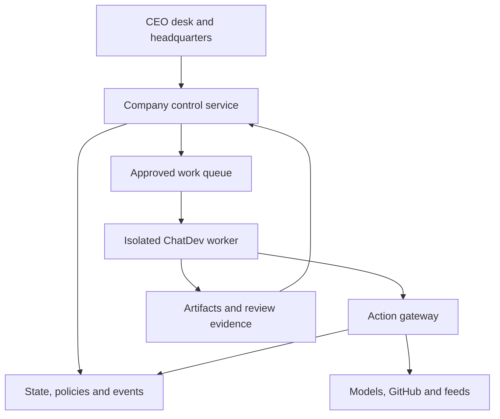

# Architecture

## Direction

Keep a company control service above ChatDev. The service owns business state, authority and budget; ChatDev executes approved workflows inside constrained workers. A model's answer is a proposal or result, not a privileged command.

## Components

| Component | Responsibility | Boundary |
|---|---|---|
| Company control service | Organization, tasks, policy, decisions and project state | Authoritative business state |
| Policy evaluator | Effective authority and explicit deny rules | Never trusts model-provided role identity |
| Scheduler | Dependencies, leases, priority and retries | Rechecks authority immediately before dispatch |
| Worker | Executes one bounded workflow/task | No database-admin or organization-wide credentials |
| Action gateway | Validates and performs external effects | Scoped credentials; auditable request/result |
| Model router | Capabilities, data classification, assignment, cost | Separate provider adapters |
| Evidence store | Versioned artifacts and source provenance | Content hashes and restricted retrieval |
| Intelligence service | Approved polling and event processing | Untrusted inputs cannot become policy |
| Building projection | Rooms, construction and activity | Reads confirmed business events |

## Technology decisions

Reference core: Python 3.12 standard library with SQLite. This keeps the initial package reproducible without package downloads. Planned service: Python/FastAPI to align with ChatDev, relational persistence with migrations, background workers, and an event stream. Prefer extending ChatDev's Vue 3 frontend for the eventual company UI to reduce framework duplication. A separate UI can be justified with a recorded decision.

Use SQLite only for local single-owner operation with controlled writes. PostgreSQL is the planned multi-worker authoritative store. Add a transactional outbox and durable queue before real external effects. Artifact blobs live outside the relational database; references, hashes and access policy remain inside it.

## Execution sequence

An authenticated requester submits a command with an idempotency key. The service validates schema and current authority, reserves maximum cost, persists a work order and an outbox event atomically. A worker claims a lease. Immediately before each external action the gateway checks current revocation/expiry, project scope, exact target and approval binding. Results are stored as artifacts. Independent checks produce review evidence. Acceptance changes project state and emits growth eligibility exactly once.

A policy change can invalidate queued work. A running action cannot always be undone; cancellation stops future effects and reconciliation records any completed side effect. Partial execution must remain visible.

## ChatDev limitation to design around

Upstream workflows can include tool/code execution. Embedding the upstream SDK in the privileged control process would bypass the intended trust boundary. Run it in an isolated worker without control-plane secrets. Disable or mediate upstream tools until their actions pass the gateway.

## Current implementation boundary

The local `Company` class remains the domain engine. M1 adds a loopback FastAPI service (`company.service`) with bearer-token identities, Alembic-versioned schema, and the `/api/v1` command envelope. Actor strings in JSON bodies are ignored. The process is still not a security boundary against someone with database or Python access. Do not expose it beyond loopback. Live ChatDev, GitHub, market, and documentation-fetch adapters still raise `NotImplementedError`. Subprocess-isolated workers (`company.worker`) dispatch mock work through a parent-mediated gateway without DB credentials; container runtime remains fail-closed until an owner-built image exists. A live model inside the gateway remains owner-configuration work.
