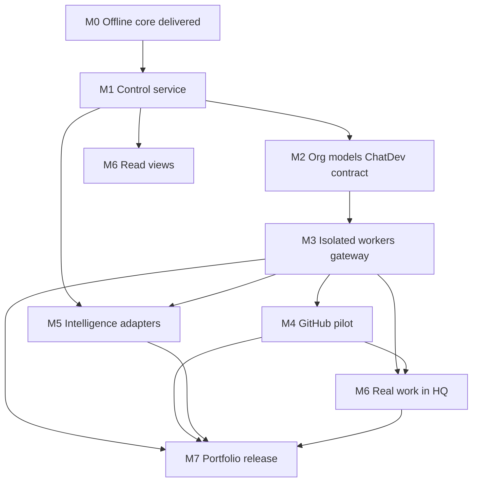

# Implementation roadmap and backlog

A milestone is complete only when its acceptance conditions are met and the handoff reflects actual behavior. Continue locally through unblocked tasks; obtain missing live configuration only when needed. This file is the authoritative nested backlog. Do not invent a parallel product.

**v0.3.74 status:** Manage visual groups on Organization, Corporate, Projects and Workers via shared `useWideViewport` + `ManageClusters` joins v0.3.73 Companion URL sync for `?tab=` and `?project=` with replaceState, v0.3.72 Projects list-row `span.muted` and Clear-on-loading, v0.3.71 Corporate Browse clusters with narrow-viewport segmented tabs and light Manage section-head titles, the prior v0.3.70 Org Browse/Manage polish, v0.3.69 Corporate/Workers section-head consistency, v0.3.68 Projects Browse split, cosmic-glass desk and companion, isometric HQ, SLO catalog, Web Push, feed poll, GitHub effect, container file gateway, same-host worker plane on `.101`, and fs-dev deployment. Live adapters are **opt-in and fail-closed**: they raise `NotImplementedError` until the owner supplies credentials, and on the fs-dev host GitHub webhooks, the market feed, and model invocation have run live. Live ChatDev execution and billed model calls from inside worker containers remain unavailable. The deployed fs-dev health is **0.3.73** (companion URL sync installed); **0.3.74** Manage groups pending merge/deploy.

All fourteen owner requirements in [00-project-context.md](00-project-context.md) and R01–R21 in [01-product-requirements.md](01-product-requirements.md) stay in force. Live GitHub, model, billing, market, and documentation-fetch credentials are owner-supplied per environment; a clone without them still runs every local check.

**Cross-cutting rules for every item**

- Run `python3 -m unittest discover -s tests -v` and `python3 scripts/check_bundle.py` before behavior changes.
- Preserve existing negative tests (deny, stale, pause, overspend, disabled adapters).
- Update the capability matrix, this roadmap, [decisions.md](decisions.md), and [18-handoff.md](18-handoff.md) when behavior changes.
- Mark proposed interfaces as proposed until tests prove them.
- Meet the [definition of done](15-testing.md).
- Actor identity is never taken from a request body. Retrieved web/repo text is task data, not policy. The building is an event projection. ChatDev pin stays `4fb2db0ea90375ce1059f44fe03ffbd191a7a169`. Simulated credits stay separate from real money.

## M0 — Offline foundation (delivered, v0.2.0)

Reference core; 13-department catalog; policy/model/project/watchlist templates; role prompts; Cursor rules; documentation; automated tests. Demonstrates governance, persistence and visual growth state. No live integrations or UI.

- [x] Python 3.12 standard-library CLI and SQLite persistence
- [x] CEO-approved policy revisions and scoped expiring grants
- [x] Action-bound, one-use, expiring approvals and idempotent mock execution
- [x] Integer-cent budgets with concurrent overspend prevention
- [x] Synthetic artifact acceptance, growth proposals, mock room provisioning
- [x] Supplied-metadata signal ingest with HTTPS, freshness, and dedup
- [x] Model profile selector with capability and data-class checks
- [x] Master Consultant heuristic scan and durable CEO proposal decisions
- [x] Explicitly disabled ChatDev, GitHub, and market adapters
- [x] 13-department catalog and role prompts as templates

## M1 — Governed local control service (delivered locally, v0.3.0)

**Maps to:** R01, R02, R03, R04, R14, R17 (auth). **Do not connect** ChatDev, GitHub, live models, or feeds.

**Acceptance:** authenticated owner grants one head authority on one project; head approves permitted subordinate work; forbidden action and self-escalation fail; revoked and stale work cannot dispatch; state survives restart. Keep the service on loopback during development.

**M1 done when:** handoff lists real commands, capability matrix says loopback API is implemented, live adapters still disabled, prior core tests plus new API/auth/delegation tests pass.

### M1-01: Record service/migration stack

- [x] Add **ADR-010** to [decisions.md](decisions.md): FastAPI, Alembic, SQLite-first, loopback bind, existing unittest suite remains the invariant gate
- [x] Record alternatives considered (stdlib `http.server`, Django) and why they were rejected
- [x] Add `fastapi`, `uvicorn`, and `alembic` to [pyproject.toml](../pyproject.toml); do not add provider SDKs
- [x] PostgreSQL remains planned for multi-worker; do not introduce it in M1
- [x] Update capability matrix in [README.md](../README.md) only after the service actually runs

### M1-02: Schema migrations for organization + identities

Replace ad-hoc `CREATE TABLE IF NOT EXISTS` in [company/core.py](../company/core.py) with a shared schema and versioned Alembic migrations covering current tables plus [03-data-model.md](03-data-model.md) entities M1 needs.

- [x] Shared DDL module used by the in-memory core and by Alembic
- [x] `identities` (principal_id, kind: owner | service, token hash, created_at, scopes) — root owner cannot be replaced by an agent
- [x] `departments` and `positions` seedable from [config/departments.json](../config/departments.json)
- [x] `projects` (id, brief, classification; GitHub IDs nullable until M4)
- [x] `delegations` (grantor, grantee, parent_id, actions, scopes, expiry, budget_cents, approval_rights, status)
- [x] Event envelope columns (`event_id`, `schema_version`, `actor_id`, `policy_version`, `correlation_id`) without breaking the existing audit hash
- [x] Migrate `consultant_proposals` rather than dropping it
- [x] Tests: existing suite still passes; CEO-mismatch still fails closed; new DB from migrations covers the overlapping tables

### M1-03: Authenticated owner and scoped service principals

- [x] Bind identity outside JSON bodies (Authorization bearer token)
- [x] Local owner bootstrap on first run; write recovery material to `.local/`, never to git
- [x] Service principals for AI CEO / department heads with explicit grants
- [x] Reject `actor=human-ceo` and any body identity field as proof of authority
- [x] Consultant adviser principal with read + propose only (R17 M1)
- [x] Tests: unauthenticated → 401; wrong principal on pause/policy → 403; body spoof of CEO does not grant CEO; consultant cannot decide own proposal; restart still knows the owner

### M1-04: Implement proposed API with schemas and idempotency

Implement [16-api-contract.md](16-api-contract.md) `/api/v1` on loopback.

- [x] Command envelope: `Idempotency-Key`, expected resource/policy version, typed payload
- [x] Responses: operation id, resource version, status, event correlation id
- [x] Status codes: 401 / 403 / 409 (stale) / 422 / 429 — **429 delivered in 0.3.42** (per-principal + IP buckets; see [16-api-contract.md](16-api-contract.md))
- [x] Same key + changed payload → reject; same key + same payload → replay original result
- [x] Keep mock dispatch only (`draft` / `review` / `prepare_pr`); adapters stay disabled
- [x] Service module `company/service.py`; tests in `tests/test_api.py`

### M1-05: Policy lifecycle

Today: propose + CEO approve only. Add:

- [x] Diff of before/after grant body
- [x] Approve / reject / withdraw
- [x] Immutable activation; rollback = new approved version restoring earlier content (never delete history)
- [x] Policy version bump invalidates outstanding approvals and rechecks queued work
- [x] Tests: stale base version → 409; reject/withdraw preserved; rollback does not erase intervening events; head cannot self-elevate

### M1-06: Parent/child delegation and delegated approval

Implement the 8-step decision algorithm in [04-governance.md](04-governance.md).

- [x] Child grant ⊆ parent (actions, projects, budget, data class, time)
- [x] Bounded redelegation depth; cycle/invalid parent rejected
- [x] Separate approval rights from execute rights
- [x] Explicit deny before allow; unknown scopes fail closed
- [x] **M1 story test:** owner authenticates → grants Engineering head on project P → head approves specialist `draft` on P → specialist mock-executes → head cannot approve policy → specialist cannot dispatch `prepare_pr` without grant → revoke head → queued specialist work will not dispatch

### M1-07: Audit export, pause/resume, backup/restore

- [x] `GET /events` cursor pagination (ACL = same as REST reads)
- [x] Pause stops new dispatch; resume is owner/CEO
- [x] `python3 -m company backup` / `restore` using the SQLite backup API; restore drill documented in [13-operations.md](13-operations.md)
- [x] Consultant: authenticated list/decide endpoints; stale-evidence rejection; revision request creates a new digest (does not mutate the old proposal) — stale-evidence covered in `tests/test_consultant.py` and `tests/test_m1.py` (0.3.46)

## M2 — Organization, models and ChatDev contract

**Depends on M1. Maps to:** R01, R05, R13, R18, R19, R20, R21. **Do not run live models.**

- [x] Load department/position catalog into persisted tables (templates become seed, not the source of truth)
- [x] Persist model profiles and versioned assignments
- [x] Selection order: task assignment → position override → department default → company default
- [x] Never broaden data classification on fallback; disabled profiles skipped with a clear error
- [x] Role benchmark fixtures (deterministic, no vendor claims) — P0.2:
      `config/benchmarks.example.json` and `GET /api/v1/benchmarks` (see M10-03).
- [x] Record the pinned ChatDev checkout (`config/upstream.lock.json`); validate `run_workflow` signature against [07-chatdev-integration.md](07-chatdev-integration.md). Fetching a live checkout remains a local operator step.
- [x] Adapter contract tests with a mock provider: WorkOrder in, isolated session name, usage metadata, cancel/fail mapping; no unapproved tools — `cancel`/`fail` covered in `tests/test_m2.py` (0.3.46)
- [x] Store work-order + workflow digests; final ChatDev message ≠ project acceptance
- [x] Hardware skill catalog, gap assignment, study/certify, and dispatch gate (R18). Live documentation fetch uses an approved HTTPS prefix allowlist (`config/learning-sources.example.json`); non-matching URLs are denied
- [x] Quality Control inspection gate before acceptance (R19)
- [x] Human Resources training roster and skill certification (R20)
- [x] Regular documented employee training, performance goals/reviews/trends, hire attributes (R21)

**Acceptance:** one mock workflow uses different eligible creator/reviewer profiles; incompatible data/capability routing fails clearly; no unapproved external tools execute. Upstream schema and output mapping are tested, not assumed. Hardware projects remain blocked until certified skills exist.

## M3 — Safe execution and real deliverables

**Depends on M1/M2. Maps to:** R03, R06, R12, R14, R16, R17. **This is the first live-model gate.** Do not skip this for a quick ChatDev demo. A live provider stays disabled until the owner supplies credentials; the boundary and mock provider must still be tested.

- [x] Isolated subprocess workers with parent-mediated gateway (no control-plane DB in worker); container runtime fail-closed until Docker image is built
- [x] Durable queue, leases, transactional outbox
- [x] Action gateway: recheck revocation/expiry/project/target/approval immediately before each external effect
- [x] Atomic budget reservation vs actual vs simulated credits (integer cents)
- [x] Artifact store outside SQLite; acceptance binds exact content hash; independent reviewer ≠ producer
- [x] Queue cancel and lease attempts; full crash/retry reconciliation still limited to mock execute idempotency
- [x] Live text model fail-closed unless a mock profile is used; configured live providers still raise NotImplementedError
- [x] Consultant: approved proposal becomes a separately authorized work order (consultant cannot execute). Bounded live AI review is not enabled.

**Acceptance:** one real document or code artifact produced and independently accepted (mock provider counts until a live model is configured); budget overspend/replay blocked; a worker cannot change policy or read another project's resources. Crash/retry reconciles output and costs.

## M4 — GitHub pilot

**Depends on M3. Maps to:** R06, R07, R08, R16. Live pilot write accepted on `athompson36/fs-corp-comp` (PR [#1](https://github.com/athompson36/fs-corp-comp/pull/1)).

- [x] GitHub App enrollment records; store immutable repo IDs; signed webhook ingress (`POST /api/v1/github/webhooks`) with delivery idempotency (live GitHub→host delivery still needs reachable HTTPS)
- [x] Allowed branch prefixes; per-task worktree paths; never overwrite the human workspace
- [x] Effect lifecycle live push/PR — `apply_github_effect` authorizes, records (repo+task+operation), then fail-closed live write until App credentials exist
- [x] Merge/deploy remain separate capabilities
- [x] Idempotency: repo + task + operation
- [x] Live adapter remains `NotImplementedError` until App credentials exist

**Acceptance:** local denial tests prove protected-branch, unrelated-repo, stale-head, and workflow-file writes fail before dispatch; duplicate dispatch does not create a duplicate effect record. Live PR on disposable enrolled repo `athompson36/fs-corp-comp` (id `1355366113`) applied via `apply_github_effect` / `scripts/exercise_github_effect.py`.

## M5 — Market intelligence

**Depends on M1/M3. Maps to:** R09. Live pilot feed approved on fs-dev: `github-blog` (`https://github.blog/feed/`), first poll applied with ingested signals.

- [x] One selected live feed adapter — `approve_feed_source` + `poll_market_feed` (fail-closed until an owner-approved live adapter exists)
- [x] Corrections linked to affected briefs
- [x] Impact brief with no auto-publish; cost recorded on the brief
- [x] Page instructions cannot amend policy
- [x] Live poll remains `NotImplementedError` until a source is approved
- [x] Skill-learning study uses the same supplied-metadata ingest as signals; `LearningAdapter.fetch` allowlists HTTPS prefixes from `config/learning-sources.example.json` (or `FS_CORP_LEARNING_SOURCES_FILE`)

**Acceptance:** a sourced event (supplied metadata or configured feed) yields one actionable brief with timestamps and affected project; duplicate feed entries create no duplicate work; page instructions cannot amend rules or trigger unauthorized publishing. Live poll on fs-dev: `scripts/exercise_feed_poll.py` / `verify_fs_dev_pilot.sh` against `github-blog`.

## M6 — CEO desk and growing headquarters

**Depends on M1 for reads; M3/M4 for real work. Maps to:** R10, R11, R15.

**Navigation:** CEO desk sidebar grouped **Home · Work · People · Money · More** with nested anchors (hybrid Home; Scorecard under Work).

- [x] First UI slice: CEO desk against the loopback API — before decorative building art
- [x] Views read persisted events; occupancy is not running-model count
- [x] Accessible 2D floor plan + list navigation; reduced motion
- [x] Facilities: costed proposal → approve → contractor provision → independent inspection → `room.built`
- [x] Growth credit once per unique accepted project; replay/retry cannot farm credits
- [x] Art/isometric animation — CEO desk isometric SVG from the same `headquarters()` rooms; rise animation respects `prefers-reduced-motion`; no invented occupancy; cosmic-glass chrome adopted; **P4 SVG furniture glyphs** from persisted `room_type` (photoreal art packs still deferred)
- [x] Track C marketing layout (0.3.59) — public token-styled `/welcome` landing with companion/desk CTAs; Caddy exact-path proxy; Marketing room types map to distinct `campaign` furniture from persisted floorplan data
- [x] Deeper marketing redesign (0.3.64) — self-hosted woff2 fonts, constellation motif, intentional motion with reduced-motion respect on `/welcome`; desk `campaign` furniture upgraded to podium + banner; no CDN fonts, photoreal art, or invented wings
- [x] Room detail — `GET /api/v1/headquarters/rooms/{id}` returns persisted tasks, staff, deliverables, simulated costs and related decisions; desk list/tiles open that panel; missing rooms fail closed
- [x] Consultant inbox: findings, evidence, approve/reject/revise (API + desk list)
- [x] Corporate HQ Phase 1 — runtime department/position editing and revision history
- [x] Corporate HQ Phase 2 — migration `0017_floorplans`, persisted grid rooms, department requirements, authenticated CRUD/default-plan API, overlap enforcement, and Desk warning chips; expansion isometric retained as the no-floorplan fallback
- [x] Corporate HQ Phase 3 — migration `0018_worker_identity`, validated sprite catalogs and HR/CEO-managed identity fields, joined worker cards, authenticated APIs, and honest clickable Desk markers
- [x] Corporate HQ Phase 4 — migration `0019_activity_projection`, idempotent event-derived work/review/meeting/context sessions, stale-session closure, company-read API, room-aware SSE frames, and reduced-motion-safe Desk badges
- [x] Corporate HQ Phase 5 — migration `0020_career_ladder`, seeded Engineering L1–L3 standards, evidence-backed promotion evaluation, HR proposals, CEO decisions, training targets, authenticated APIs, and minimal Desk ladder/pending-promotion views
- [x] Corporate HQ Phase 6 — migration `0021_staffing_proposals`, cooldown-limited evidence scans, pending-proposal deduplication, HR/CEO proposal authority, CEO/admin decisions, atomic approval-gated hires, authenticated APIs, and Desk approve/reject controls
- [x] Corporate HQ Phase 7 — migration `0022_divisions`, four persisted industry packs, consultant/CEO/seated-head proposals, CEO/admin atomic activation, division departments/skills/floorplans, open-work deactivation gates, authenticated APIs, and Desk controls
- [x] Corporate HQ Phase 8 — migration `0023_ceo_scorecard`, persisted-data-only CEO scorecard, optional snapshots, CEO/admin objective lifecycle, authenticated APIs, and Desk create/close controls
- [x] Desk IA aligned to five companion domains (0.3.67) — rail grouped Home · Work · People · Money · More; page sections reordered; hybrid Home keeps HQ high; Scorecard under Work; no ID renames or domain panes

**Acceptance:** one accepted project earns progress; justified expansion is approved and provisioned; a room opens real department data; restart/replay keeps room identity and count. Reduced-motion and list navigation work.

### M-HQ — Corporate headquarters phases

- [x] Phase 1: runtime departments and positions
- [x] Phase 2: persisted floorplans and requirements
- [x] Phase 3: worker identity and sprites
- [x] Phase 4: event-projected live activity
- [x] Phase 5: career ladders and promotions
- [x] Phase 6: approval-gated staffing proposals
- [x] Phase 7: divisions and industry packs
- [x] Phase 8: CEO scorecard and objectives

## M7 — Portfolio operations and release readiness

**Maps to:** R12, R13, remaining R14. Release criteria in [12-security.md](12-security.md) are the gate, not mock tests.

- [x] Memory ACLs and approved procedures
- [x] Provider benchmarks with recorded quality/latency/cost (fixtures until live providers exist)
- [x] Monthly budget periods as an additional cap; full forecast/refunds not implemented
- [x] Two concurrent projects with no cross-leakage or overspend
- [x] Backup/restore commands and operations notes
- [x] Measured SLOs — catalog + sourced `slo_observations`; remain `unmeasured` until an owner records a windowed sample; no invented met/breached targets
- [x] Consultant review cooldowns; independent before/after validation still requires a live change (P2 exposes `GET /api/v1/consultant/reviews` for cooldown honesty; no invented efficiency scores)
- [x] Explicit refusal of non-loopback binds; human approval still required before any deployment

**Acceptance:** two projects operate concurrently without cross-project data leakage or overspend; interruption/recovery tested; all claims in the capability matrix verified. Establish operational SLOs from measurement.

## M8 — Mobile CEO companion

**Depends on M1/M6. Maps to:** R02, R14, R22.

- [x] Dashboard read API aggregating company, projects, decisions, queues, owner inbox
- [x] Project list/detail and dispatch-brief with per-department budgets; dormant
      departments require project activation and vacant heads remain explicitly blocked
- [x] Head inbox read and grant/roster-checked dispatch assignment into the specialist queue;
      v0.3.51 desk and companion surfaces render catalog/seat/roster state and provide
      scoped assignment forms without inventing occupied seats
- [x] Additive cross-department request API persists explicit requesting/delivering
      departments, budget owner, due date, acceptance criteria, escalation path and budget;
      dormant delivery fails closed and only the seated delivering head or CEO/admin accepts
- [x] Owner inbox (`owner_requests`) with head escalation and CEO response
- [x] Unified decisions inbox; reuse existing approve/reject endpoints
- [x] SSE event stream; PWA polls as fallback
- [x] Tailscale bind via `--allow-remote` (documented; not public internet)
- [x] Mobile PWA in `companion/`; thin Expo shell in `companion-native/`
- [x] Push notifications — `register_push_subscription` / `notify_push` (HTTPS only; live VAPID send when keys configured); owner-inbox create attempts delivery
- [x] QR pairing with access levels (`read_only`, `user`, `admin`); desk issues QR; companion auto-redeems `#fs-pair`; optional Tailscale auth key on redeem
- [x] Workers tab — primary tab lists remote worker hosts (API `state`); create with one-time token; enable/disable/delete when CEO + `company.pause` (0.3.63); runbook in [25-fs-dev-deployment.md](25-fs-dev-deployment.md)
- [x] Companion shell + CEO spine (0.3.65) — five-domain Home · Work · People · Money · More
      navigation; Home Needs-you queue reuses persisted decisions and owner inbox with scoped
      inline actions; shared Syne/Manrope brand fonts align companion, desk and welcome
- [x] Work/People/Money structure (0.3.66) — Projects, Corporate, Workers and Organization
      default to local Browse views and group create/enroll/configure controls under Manage;
      Finance retains Overview · Invoices · Adjustments · Periods without a nested mode layer
- [x] Projects Browse split + medium polish (0.3.68) — Projects Browse uses a
      responsive list|detail split; detail holds the dispatch workspace; Clear
      selection returns the empty “Select a project” pane; Manage remains
      enroll/assign; Corporate, Workers and Organization get medium empty/section
      polish; no URL sync, Finance ModeSwitch or new APIs
- [x] Corporate/Workers Browse section consistency (0.3.69) — Corporate Browse
      lists use section-head + panel-empty; Workers title sits outside the list
      card; no groups, Org restructure, URL sync, Finance ModeSwitch or new APIs
- [x] Org Browse/Manage section-head consistency (0.3.70) — Organization
      catalog uses a Departments section-head; Manage form titles sit outside
      form cards; Head inbox/assign unchanged; no Manage groups, URL sync,
      Corporate groups, Finance ModeSwitch or new APIs
- [x] Corporate Browse clusters (0.3.71) — Strategy · Structure · People ·
      Coordination clusters with `cluster-head`; segmented tabs below 720px;
      Manage section-head titles for four forms; no URL sync, Manage groups,
      Finance ModeSwitch or new APIs
- [x] Projects list-row Clear-on-loading (0.3.72) — list rows use `span.muted`
      inside buttons; loading detail shows `detail-toolbar` with Clear
      selection; empty pane unchanged; no URL sync, Manage groups, Finance
      ModeSwitch or new APIs
- [x] Companion URL sync (0.3.73) — `?tab=` and `?project=` deep links with
      `replaceState`; unknown project clears silently; leaving Projects or Clear
      drops `project`; pairing hash unchanged; no Router, Manage groups,
      Finance ModeSwitch or new APIs
- [x] Manage visual groups (0.3.74) — shared `useWideViewport` +
      `ManageClusters` on Org/Corporate/Projects/Workers Manage; Corporate Browse
      uses shared hook; no URL sync, Finance ModeSwitch or new APIs

**Acceptance:** over Tailscale or LAN HTTPS, owner issues admin QR, phone auto-configures, approves a proposal, dispatches a project brief, and responds to an owner request; read_only QR hides approve/pause; denial tests still pass.

## M9 — fs-dev deployment

**Depends on M1/M8. Maps to:** R02, R14, production operations.

- [x] Hybrid topology: native systemd control API on loopback, Caddy HTTPS edge, companion static, Docker workers scaffold only
- [x] NIC plan: `192.168.4.100` phase 1 (Caddy); `192.168.4.101` reserved phase 2 (documented)
- [x] Phone access via LAN `https://192.168.4.100` and optional Tailscale site block in Caddyfile
- [x] Security: API `127.0.0.1:8000` only; Caddy terminates TLS; `ufw.rules.example` denies LAN:8000
- [x] Idempotent `deploy/fs-dev/install.sh`, `fs-corporation-api.service`, Caddyfile, `env.example`
- [x] Health check `GET /api/v1/health` documented and verifiable on loopback and via Caddy
- [x] Worker Docker scaffold (`Dockerfile.worker`, `docker-compose.workers.yml`) with scratch-directory gateway (`python -m company.worker --envelope/--scratch`); image builds and dispatches on the same host, and workers stay `--network none` rather than binding `.101`
- [x] ADR-016; canonical runbook [25-fs-dev-deployment.md](25-fs-dev-deployment.md)
- [x] Phase 1 acceptance on physical fs-dev (`192.168.4.100`): install, API, Caddy, companion, pairing, Apple Web Push `applied`
- [x] Phase 2 (same-host): `FS_CORP_DEFAULT_WORKER_RUNTIME=container`, worker NIC `.101` presence in status, container labels; workers remain `--network none`
- [x] Phase 2 (follow-on): host gateway egress via `.101` (`FS_CORP_GATEWAY_EGRESS=worker_nic`, policy routing for `fs-corp`); dedicated second worker host still optional
- [x] Same-host worker plane: `worker_plane` on `/api/v1/workers/status` (healthy/degraded/unset, soft); verify script `--require-plane`

**Acceptance:** on a Debian host with static `192.168.4.100`, `install.sh` completes; `fs-corporation-api` is active; `curl` to loopback `/api/v1/health` returns 200; phone opens `https://192.168.4.100`, companion loads with same-origin API and owner token; port 8000 is not reachable from LAN; denial tests still pass. Container worker image builds locally; live adapter dispatch remains fail-closed.

## M10 — Audit remediation (2026-09-07)

**Depends on M1–M9.** Opened by the full-project audit at 0.3.41. Every item here is a gap
the audit confirmed against code, not a new feature. Nothing in M10 blocks the optional
tracks (TailscaleKit, second worker host, ChatDev egress).

### M10-01: Correctness and durability

- [x] **HTTP `429` and request throttling** (0.3.42). Per-principal sliding window on
      authenticated routes; per-IP window on webhook and pairing redeem; `/`, `/desk`, and
      `/api/v1/health` exempt. Tests in `tests/test_rate_limit.py`.
- [x] **Run migrations at startup** (0.3.43). File-backed `Company()` closes its first
      connection, runs `alembic upgrade head` via `company.migrate.ensure_migrations`, and
      fails closed if still behind head. `:memory:` databases skip Alembic (SCHEMA is
      authoritative). Concurrent openers of the same path are serialized. Test:
      `tests/test_migrate.py`.
- [x] **Record idempotency atomically with the effect it protects** (0.3.44). `Company.tx()`
      is re-entrant; `run_idempotent` runs the handler and inserts `command_idempotency` in one
      transaction; API `run()` uses it whenever an Idempotency-Key is present. Tests in
      `tests/test_idempotency_atomic.py`.
- [x] **Close the worker-completion transaction gap** (0.3.45). `Company.mark_worker_completed`
      finishes the run, marks the queue done, and emits `task.worker_completed` in one
      transaction; both subprocess and container runtimes use it. Test asserts a simulated
      crash rolls all three back.
- [x] **Add an idempotency-key retention policy** (P0.2). Default 7 days via
      `FS_CORP_IDEMPOTENCY_RETENTION_DAYS`; `Company.prune_idempotency_keys` +
      `POST /api/v1/ops/idempotency/prune`. Tests in `tests/test_m10_ops.py`.

### M10-02: Test gaps behind previously claimed items

- [x] **Adapter `cancel` / `fail` mapping tests** (0.3.46). `tests/test_m2.py` asserts shapes
      and that neither path sets `accepted`.
- [x] **Consultant stale-evidence rejection test** (0.3.46). `tests/test_consultant.py` (also
      covered earlier in `tests/test_m1.py`).
- [x] **Non-loopback bind refusal test** (0.3.46). `tests/test_service_edges.py` drives
      `python -m company.service --host 0.0.0.0` and asserts the refuse-closed exit. Starting
      a live server with `--allow-remote` is left to operator verification.
- [x] **SSE stream test** (0.3.46). Consumes frames from `GET /api/v1/events/stream`; each
      frame is `{seq, kind, at}` only. `FS_CORP_SSE_IDLE_SEC=0` ends the stream after one page
      so the suite does not hang.

### M10-03: Financial model completeness

- [x] **Separate actual billed cost from simulated credits** (0.3.48). Tables
      `billed_costs` / Alembic `0013`; live `invoke_model` writes a row with honest
      `amount_cents` (0 until priced) and `usage_tokens`. Mock does not write. Provider
      no longer labels token counts as cents. `status()` / desk expose `billed_cost_cents`
      separately from `simulated_spend_cents`.
- [x] **Model real revenue** (0.3.48). `revenue` table + CEO `record_revenue`;
      `revenue_cents` on status, never mixed into simulated totals.
- [x] **Give `benchmark_results` and `model_profiles` a read path** (P0.2).
      `list_model_profiles` / `list_benchmark_results`; `GET /api/v1/model-profiles` and
      `GET /api/v1/benchmarks`. Tests in `tests/test_m10_ops.py`.
- [x] **Role benchmark fixtures (deterministic, no vendor claims)** (P0.2).
      `config/benchmarks.example.json` + `seed_benchmarks`; read through list path.

### M10-04: Operator visibility and UI

- [x] **Fix the hanging companion build** (0.3.47 / companion 0.3.7). Abandoned
      `injectManifest`/`src/sw.ts` (Vite 6 hang). Switched to `generateSW` with push
      handlers in `public/sw-push.js` via Workbox `importScripts`; `vite-plugin-pwa`
      ^1.2.0; Node 18 crypto polyfill + Workbox `mode: "development"` so SW generation
      exits. `npm run build` emits `dist/sw.js` and `dist/sw-push.js`. Phone offline /
      update-on-reload still needs an owner smoke check after the next fs-dev install.
- [x] **Surface operational status in the UI** (0.3.50). Desk **Diagnostics** and companion
      Diagnostics tab probe `health`, `workers/status`, `model/status`, `github/status`,
      `push/status`, `chatdev/status`, `feeds`, `slos`, and `local-repos` in parallel; failed
      probes show unavailable rather than invented healthy state. Local repo candidates appear
      under Projects with tap-to-enroll.
- [x] **Display the version.** Desk rail footer `#desk-version` and companion strip above tabs
      show backend `GET /api/v1/health` → `version` (P5 / ADR-041). Diagnostics still probes health.
- [x] **Keyboard access for HQ room tiles.** Plan/iso tiles and worker markers are focusable
      (`tabindex`, `role="button"`) and activate on Enter/Space (P5).
- [x] **Replace remaining `window.prompt` in the companion** (P0.2). Inbox response,
      escalation, and project enroll use labeled forms; source assertion that `window.prompt`
      is absent from `App.tsx`.

### M10-05: Documentation and decision hygiene

- [x] **ADRs for four undocumented decisions:** GitHub webhook ingress, path-scoped Tailscale
      Funnel, the same-host worker plane, and the ChatDev adapter slices. Each shipped with a
      spec but no entry in [decisions.md](decisions.md). Added as ADR-021 through ADR-024,
      each recorded retroactively and marked as such.
- [x] **Keep plan checkboxes honest** (P0.2 convention). Documented in
      [15-testing.md](15-testing.md): when a plan `Status:` is `implemented`, leave step
      boxes unticked and rely on the Status line plus roadmap/`VERIFICATION.md` for
      completion claims. Do not mark roadmap `[x]` without a test or code path.

**Acceptance for M10:** no roadmap item is marked `[x]` without code or a test behind it;
`VERIFICATION.md` matches what the suite actually proves; and the test suite passes both
with and without a developer `.env` exported.

## Suggested first production slice

Do not activate every department. Per [05-organization.md](05-organization.md):

1. Owner + hybrid CEO
2. Engineering head + creator
3. Quality Control inspector (required before acceptance)
4. Human Resources for training certification when skills are missing
5. One enrolled disposable fork
6. One modest file change, QC-inspected and independently accepted — exercised via `scripts/exercise_production_slice.py` on fs-dev (`app` completion + live PR)
7. Then Art/Marketing on the same project — dispatch briefs + mock drafts in the same exercise
8. Keep Product, Sales, Legal, and others as templates until a capacity case exists

Initial active catalog already marked: Executive, Engineering, Quality Control, Art, Marketing, Finance, Facilities, Human Resources.

## Master Consultant additions

- **0.2.0 delivered:** read-only heuristic scanner, local durable proposal submission/deduplication, CEO approve/reject and audit events
- **M1:** authenticated adviser scopes and decision endpoints; revision requests and stale-evidence handling
- **M3:** bounded AI review and isolated diagnostics against exact revisions; approved proposal to separately authorized work order
- **M6:** CEO consultant inbox with findings, evidence and decisions
- **M7:** measured workflow/model/organization efficiency reviews, trigger scheduling, proposal cooldowns and independent before/after validation

## Owner-supplied configuration (later milestones)

Selected GitHub repository/fork IDs and App installation; exact enabled provider/model IDs and credentials; actual spending caps; approved sources/watchlists; deployment target. Visual system is cosmic restraint; furnished room art remains deferred. Do not infer remaining values from unrelated user history.

## Immediate next implementation task

**Manage visual groups 0.3.74 is on `main` and fs-dev** (tip `bce7048`).
Organization, Corporate, Projects and Workers Manage use shared hybrid cluster
chrome; Corporate Browse shares `useWideViewport`. No Manage/Browse URL sync,
Finance ModeSwitch, new APIs or Alembic revision. Next: owner-directed
(empty-list unknown-project edge nit, Manage/Browse URL sync, Finance ModeSwitch,
or other companion/desk follow-ups).
