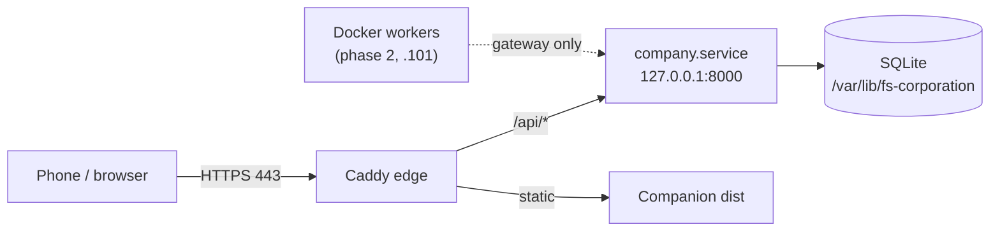

# fs-dev deployment (M9)

Canonical runbook for hosting FS-Corporation on an **owned Debian host** (`fs-dev`). Phase 1 delivers a hybrid topology: the control API runs **natively under systemd** on loopback, **Caddy** terminates TLS at the edge and serves the mobile companion PWA, and **Docker** is scaffolded for isolated workers only (not enabled for live dispatch until owner credentials and adapters are wired).

Artifacts live in [`deploy/fs-dev/`](../deploy/fs-dev/). This document is the operator-facing source of truth; the directory README is a short index.

## Topology



| Component | Phase | Bind / path | Notes |
|-----------|-------|-------------|--------|
| Control API | 1 | `127.0.0.1:8000` | `fs-corporation-api.service`; never on LAN |
| Caddy edge | 1 | `192.168.4.100:443` | TLS (`tls internal`); companion + `/api/*` proxy |
| Companion PWA | 1 | `/var/lib/fs-corporation/companion/dist` | Built by `install.sh`; same-origin API in production |
| Tailscale site | 1 (optional) | `https://100.x.x.x` | Second Caddy block; same `lan_site` import |
| Worker host NIC | 2 | `192.168.4.101` | Reserved for container workers / internal traffic |
| Docker workers | 2 | `network_mode: none` | Image scaffold only until live adapters configured |

**Hybrid rule:** native control plane + Caddy edge on the owned host; **Docker for workers only** (ADR-016). Do not containerize the control API in phase 1.

## Network plan (NIC addresses)

| Address | Phase | Role |
|---------|-------|------|
| `192.168.4.100` | 1 | Primary LAN edge — static IP on the host's primary interface; Caddy HTTPS |
| `192.168.4.101` | 2 | Reserved worker / internal NIC — document only; no install steps until phase 2 |

Configure the host with a static `192.168.4.100/24` (or your LAN prefix) before running install. DNS is not required for LAN phone access.

## Phone access

### Same LAN (phase 1)

1. Phone and host on the same private LAN (e.g. `192.168.4.0/24`).
2. Open **`https://192.168.4.100`** in the mobile browser (accept the internal CA warning from `tls internal`, or install Caddy's root if you prefer).
3. In companion **Settings**, leave **API base URL** empty (same-origin) or set it to `https://192.168.4.100`. Paste the owner bearer token from `/etc/fs-corporation/owner.token`.

Production builds should set `VITE_API_BASE=` (empty) so relative `/api/*` requests go through Caddy. See [24-mobile-companion.md](24-mobile-companion.md).

### Tailscale (optional)

1. Install Tailscale on the host and phone; join the same tailnet.
2. Uncomment the Tailscale `https://` block in [`deploy/fs-dev/Caddyfile`](../deploy/fs-dev/Caddyfile) and set `100.x.x.x` from `tailscale ip -4`.
3. Allow HTTPS on `tailscale0` in UFW (see below).
4. Open **`https://100.x.x.x`** on the phone; same token and empty API base as LAN.

Do **not** expose port `8000` on the public internet. Remote dev without Caddy may use `--allow-remote` on a tailnet IP only; that is a development shortcut, not the fs-dev production path.

## Security model

| Layer | Requirement |
|-------|-------------|
| API | Binds **`127.0.0.1:8000` only** via systemd; unreachable from LAN |
| Edge | **Caddy** listens on **443**; terminates TLS; proxies `/api/*` to loopback |
| Firewall | **ufw**: allow 22 (SSH) and 443 (LAN ± Tailscale); **deny 8000** on external interfaces |
| Secrets | Owner token at `/etc/fs-corporation/owner.token` (mode `600`, user `fs-corp`) |
| Workers | No control-plane DB or bearer tokens inside worker containers |

The phone and browser are **not** trust boundaries. All mutations require the same scoped bearer token as the CEO desk.

## Prerequisites

- Debian 12+ (or equivalent) with `sudo`
- Repository clone or rsync on the host
- Static LAN IP `192.168.4.100` on the primary NIC
- Optional: Tailscale for off-LAN access

## Step-by-step install

All commands assume the **repository root** on the target host unless noted.

### 1. Environment file

```bash
sudo mkdir -p /etc/fs-corporation
sudo cp deploy/fs-dev/env.example /etc/fs-corporation/env
sudo chmod 640 /etc/fs-corporation/env
```

Edit `/etc/fs-corporation/env` if install paths or IPs differ. Defaults include `FS_CORP_LAN_IP=192.168.4.100` and reserved `FS_CORP_WORKER_NIC_IP=192.168.4.101`.

### 2. Automated install (`install.sh`)

```bash
sudo deploy/fs-dev/install.sh
```

The script is **idempotent**. It:

- Creates system user `fs-corp`
- Installs Python 3.12, Node, Caddy, and ufw packages
- Syncs the app tree to `/opt/fs-corporation`
- Creates venv, `pip install -e .`, runs `alembic upgrade head`
- Creates `/var/lib/fs-corporation`, `/etc/fs-corporation`, owner token if missing
- Builds companion PWA to `/var/lib/fs-corporation/companion/dist`
- Installs and starts **`fs-corporation-api`** systemd unit

Override paths with environment variables documented in `env.example` (e.g. `FS_CORP_INSTALL_DIR`, `FS_CORP_DB`).

### 3. systemd (control API)

Unit file: [`deploy/fs-dev/fs-corporation-api.service`](../deploy/fs-dev/fs-corporation-api.service).

```bash
sudo systemctl status fs-corporation-api
sudo journalctl -u fs-corporation-api -f
```

The service runs:

```text
python -m company.service --host 127.0.0.1 --port 8000 \
  --db /var/lib/fs-corporation/company.db \
  --token-file /etc/fs-corporation/owner.token \
  --data-dir /var/lib/fs-corporation
```

### 4. Caddy (HTTPS edge)

1. Edit [`deploy/fs-dev/Caddyfile`](../deploy/fs-dev/Caddyfile): confirm `https://192.168.4.100`; uncomment Tailscale block when ready.
2. Install and reload:

```bash
sudo cp deploy/fs-dev/Caddyfile /etc/caddy/Caddyfile
sudo systemctl enable --now caddy
sudo systemctl reload caddy
```

Caddy behavior:

- `/api/v1/events/stream` — reverse proxy with SSE-friendly flush (no buffering)
- `/api/*` — reverse proxy to `127.0.0.1:8000`
- All other paths — companion static files with SPA fallback (`try_files` → `index.html`)

### 5. Firewall (ufw)

Review [`deploy/fs-dev/ufw.rules.example`](../deploy/fs-dev/ufw.rules.example). Example goals:

```bash
sudo ufw default deny incoming
sudo ufw default allow outgoing
sudo ufw allow in on eth0 from 192.168.4.0/24 to any port 22 proto tcp
sudo ufw allow in on eth0 from 192.168.4.0/24 to any port 443 proto tcp
sudo ufw allow in on tailscale0 to any port 443 proto tcp   # if using Tailscale
sudo ufw deny in on eth0 to any port 8000 proto tcp
sudo ufw enable
sudo ufw status verbose
```

Replace `eth0` with your interface name (`ip link`).

### 6. Owner token

After install:

```bash
sudo cat /etc/fs-corporation/owner.token   # copy once; treat as root credential
```

Configure the companion PWA Settings screen. Rotate via `register_identity` if a device is lost.

## Health checks

| Check | Command | Expected |
|-------|---------|----------|
| API (loopback) | `curl -sS -o /dev/null -w "%{http_code}\n" http://127.0.0.1:8000/api/v1/health` | `200` |
| Edge + static | `curl -k -sS -o /dev/null -w "%{http_code}\n" https://192.168.4.100/` | `200` |
| systemd | `systemctl is-active fs-corporation-api` | `active` |

`GET /api/v1/health` requires no authentication and confirms the control service is up.

## Worker Docker scaffold (disabled until live adapters)

Phase 1 **does not** dispatch container workers in production. Subprocess workers remain the default for local development. The following files exist for phase 2 build and smoke test only:

| File | Purpose |
|------|---------|
| `deploy/fs-dev/Dockerfile.worker` | Python 3.12 worker image (`fs-corporation-worker:local`) |
| `deploy/fs-dev/docker-compose.workers.yml` | Local compose smoke test (`network_mode: none`) |

Build on the host when ready:

```bash
docker build -f deploy/fs-dev/Dockerfile.worker -t fs-corporation-worker:local .
docker compose -f deploy/fs-dev/docker-compose.workers.yml build
```

`ContainerWorkerRuntime` pumps a scratch-directory gateway (`gw-request.json` / `gw-response.json`) so the image can complete mock work without a control-plane database. Live model/GitHub adapters inside that gateway remain fail-closed until the owner supplies credentials. See [23-isolated-workers.md](23-isolated-workers.md).

## Upgrades

```bash
cd /path/to/checkout
git pull
sudo FS_CORP_INSTALL_DIR=/opt/fs-corporation deploy/fs-dev/install.sh
```

Companion assets are rebuilt; systemd restarts the API. Reload Caddy if the Caddyfile changed.

## Phase 2 (documented only — not in scope for M9 delivery)

The following are **planned** on `192.168.4.101` and owner live configuration; do not treat them as complete when M9 is marked delivered:

- Dedicated worker host or second NIC at **`192.168.4.101`** for container worker traffic
- Owner-supplied **GitHub App**, disposable repo IDs, and **model credentials** inside the worker/gateway boundary
- Production **`runtime: container`** dispatch with `fs-corporation-worker:local`
- Optional approved market feed adapter
- Live Web Push (VAPID keys); subscriptions and `live_unavailable` deliveries already persist
- PostgreSQL or HA control plane (still deferred; SQLite remains phase 1 store)

**Immediate next implementation task:** owner live config + container worker image exercised on `.101`.

## Limitations

- `--data-dir` on `company.service` is part of the fs-dev contract; align installed package version with `python -m company.service --help`.
- Container worker `main()` may still be a stub until gateway proxy is fully implemented; subprocess workers remain the dev default.
- Live GitHub, billing, and model providers remain owner-configured and fail-closed until wired in config.
- `tls internal` uses a private CA; phones will warn until the cert is trusted or replaced with a real certificate.

## Related documents

- [13-operations.md](13-operations.md) — loopback + proxy production model vs dev `--allow-remote`
- [24-mobile-companion.md](24-mobile-companion.md) — PWA settings for LAN and Tailscale
- [23-isolated-workers.md](23-isolated-workers.md) — worker runtime and gateway
- [decisions.md](decisions.md) — ADR-016
