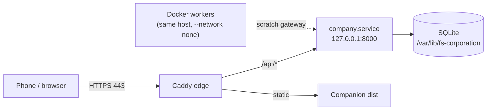

# fs-dev deployment (M9)

Canonical runbook for hosting FS-Corporation on an **owned Debian host** (`fs-dev`). Phase 1 delivers a hybrid topology: the control API runs **natively under systemd** on loopback, **Caddy** terminates TLS at the edge and serves the mobile companion PWA, and **Docker** is scaffolded for isolated workers only (not enabled for live dispatch until owner credentials and adapters are wired).

Artifacts live in [`deploy/fs-dev/`](../deploy/fs-dev/). This document is the operator-facing source of truth; the directory README is a short index.

## Topology



| Component | Phase | Bind / path | Notes |
|-----------|-------|-------------|--------|
| Control API | 1 | `127.0.0.1:8000` | `fs-corporation-api.service`; never on LAN |
| Caddy edge | 1 | `192.168.4.100:443` | TLS (`tls internal`); companion + `/api/*` proxy |
| Companion PWA | 1 | `/var/lib/fs-corporation/companion/dist` | Built by `install.sh`; same-origin API in production |
| Tailscale site | 1 (optional) | `https://100.x.x.x` | Second Caddy block; same `lan_site` import |
| Same-host worker plane | 2 | `192.168.4.101` | Second address on this host. Identity and health signal reported as `worker_plane`; also the gateway egress source when `FS_CORP_GATEWAY_EGRESS=worker_nic`. Workers do not bind it |
| Docker workers | 2 | `network_mode: none` | Same host as the control plane; scratch-directory gateway, no network |

**Hybrid rule:** native control plane + Caddy edge on the owned host; **Docker for workers only** (ADR-016). Do not containerize the control API in phase 1.

## Network plan (NIC addresses)

| Address | Phase | Role |
|---------|-------|------|
| `192.168.4.100` | 1 | Primary LAN edge — static IP on the host's primary interface; Caddy HTTPS |
| `192.168.4.101` | 2 | Same-host worker plane — a second address on the same machine, not a second machine |

Configure the host with a static `192.168.4.100/24` (or your LAN prefix) before running install. DNS is not required for LAN phone access.

**What `.101` is and is not.** It is a worker-plane *identity* on this host: set
`FS_CORP_WORKER_NIC_IP=192.168.4.101` and `/api/v1/workers/status` reports `worker_plane` as
`healthy` (address present), `degraded` (configured but not assigned to any interface), or
`unset` (not configured). The check is **soft** — a degraded plane never blocks container
dispatch, because workers run `--network none` and never bind the address. Its one functional
use is gateway egress: with `FS_CORP_GATEWAY_EGRESS=worker_nic`, control-plane outbound traffic
leaves via `.101`. A genuinely separate worker *host* remains an optional future track.

## Phone access

### Same LAN (phase 1)

1. Phone and host on the same private LAN (e.g. `192.168.4.0/24`).
2. Open **`https://192.168.4.100`** in the mobile browser (accept the internal CA warning from `tls internal`, or install Caddy's root if you prefer).
3. In companion **Settings**, leave **API base URL** empty (same-origin) or set it to `https://192.168.4.100`. Paste the owner bearer token from `/etc/fs-corporation/owner.token`.

Production builds should set `VITE_API_BASE=` (empty) so relative `/api/*` requests go through Caddy. See [24-mobile-companion.md](24-mobile-companion.md).

### Tailscale Funnel (optional — GitHub webhooks only)

To let github.com deliver signed webhooks without a public LAN IP:

1. Enable Funnel for the `fs-dev` node in the Tailscale admin (consent URL from `tailscale funnel` / ACL `funnel`).
2. Set `FS_CORP_TAILSCALE_FUNNEL_WEBHOOKS=1` in `/etc/fs-corporation/env` (pilot `deploy_to_fs_dev.sh` writes this into `env.prepared`).
3. Run `sudo bash /opt/fs-corporation/deploy/fs-dev/tailscale-funnel-webhooks.sh apply` (times out in 45s if Funnel ACL is missing — does not hang install).
4. Use the URL from `GET /api/v1/github/status` → `funnel_webhooks.public_url` as the GitHub App webhook URL (only present when Funnel is actually serving the path).
5. Optional check: `python3 scripts/exercise_funnel_webhook.py`.

This mounts **only** `/api/v1/github/webhooks` (HMAC still required). It does not Funnel the companion or CEO desk.

### Tailscale (optional)

- `deploy/fs-dev/tailscale-join.sh` joins the host and patches Caddy for the tailnet IP.

1. Install Tailscale on the host and phone; join the same tailnet.
2. Uncomment the Tailscale `https://` block in [`deploy/fs-dev/Caddyfile`](../deploy/fs-dev/Caddyfile) and set `100.x.x.x` from `tailscale ip -4`.
3. Allow HTTPS on `tailscale0` in UFW (see below).
4. Open **`https://100.x.x.x`** on the phone; same token and empty API base as LAN.

Do **not** expose port `8000` on the public internet. Remote dev without Caddy may use `--allow-remote` on a tailnet IP only; that is a development shortcut, not the fs-dev production path.

## Security model

| Layer | Requirement |
|-------|-------------|
| API | Binds **`127.0.0.1:8000` only** via systemd; unreachable from LAN |
| Edge | **Caddy** listens on **443**; terminates TLS; proxies `/api/*` to loopback |
| Firewall | **ufw**: allow 22 (SSH) and 443 (LAN ± Tailscale); **deny 8000** on external interfaces |
| Secrets | Owner token at `/etc/fs-corporation/owner.token` (mode `600`, user `fs-corp`) |
| Workers | No control-plane DB or bearer tokens inside worker containers |

The phone and browser are **not** trust boundaries. All mutations require the same scoped bearer token as the CEO desk.

## Prerequisites

- Debian 12+ (or equivalent) with `sudo`
- Repository clone or rsync on the host
- Static LAN IP `192.168.4.100` on the primary NIC
- Optional: Tailscale for off-LAN access

## Step-by-step install

All commands assume the **repository root** on the target host unless noted.

### 1. Environment file

```bash
sudo mkdir -p /etc/fs-corporation
sudo cp deploy/fs-dev/env.example /etc/fs-corporation/env
sudo chmod 640 /etc/fs-corporation/env
```

Edit `/etc/fs-corporation/env` if install paths or IPs differ. Defaults include `FS_CORP_LAN_IP=192.168.4.100` and reserved `FS_CORP_WORKER_NIC_IP=192.168.4.101`.

### 2. Automated install (`install.sh`)

```bash
sudo deploy/fs-dev/install.sh
```

The script is **idempotent**. It:

- Creates system user `fs-corp`
- Installs Python 3.12, Node, Caddy, and ufw packages
- Syncs the app tree to `/opt/fs-corporation`
- Creates venv, `pip install -e .`, runs `alembic upgrade head`
- Creates `/var/lib/fs-corporation`, `/etc/fs-corporation`, owner token if missing
- Builds companion PWA to `/var/lib/fs-corporation/companion/dist`
- Installs and starts **`fs-corporation-api`** systemd unit

Override paths with environment variables documented in `env.example` (e.g. `FS_CORP_INSTALL_DIR`, `FS_CORP_DB`).

### 3. systemd (control API)

Unit file: [`deploy/fs-dev/fs-corporation-api.service`](../deploy/fs-dev/fs-corporation-api.service).

```bash
sudo systemctl status fs-corporation-api
sudo journalctl -u fs-corporation-api -f
```

The service runs:

```text
python -m company.service --host 127.0.0.1 --port 8000 \
  --db /var/lib/fs-corporation/company.db \
  --token-file /etc/fs-corporation/owner.token \
  --data-dir /var/lib/fs-corporation
```

### 4. Caddy (HTTPS edge)

1. Edit [`deploy/fs-dev/Caddyfile`](../deploy/fs-dev/Caddyfile): confirm `https://192.168.4.100`; uncomment Tailscale block when ready.
2. Install and reload:

```bash
sudo cp deploy/fs-dev/Caddyfile /etc/caddy/Caddyfile
sudo systemctl enable --now caddy
sudo systemctl reload caddy
```

Caddy behavior:

- `/api/v1/events/stream` — reverse proxy with SSE-friendly flush (no buffering)
- `/api/*` — reverse proxy to `127.0.0.1:8000`
- All other paths — companion static files with SPA fallback (`try_files` → `index.html`)

### 5. Firewall (ufw)

Review [`deploy/fs-dev/ufw.rules.example`](../deploy/fs-dev/ufw.rules.example). Example goals:

```bash
sudo ufw default deny incoming
sudo ufw default allow outgoing
sudo ufw allow in on eth0 from 192.168.4.0/24 to any port 22 proto tcp
sudo ufw allow in on eth0 from 192.168.4.0/24 to any port 443 proto tcp
sudo ufw allow in on tailscale0 to any port 443 proto tcp   # if using Tailscale
sudo ufw deny in on eth0 to any port 8000 proto tcp
sudo ufw enable
sudo ufw status verbose
```

Replace `eth0` with your interface name (`ip link`).

### 6. Owner token

After install:

```bash
sudo cat /etc/fs-corporation/owner.token   # copy once; treat as root credential
```

Configure the companion PWA Settings screen. Rotate via `register_identity` if a device is lost.

## Health checks

| Check | Command | Expected |
|-------|---------|----------|
| API (loopback) | `curl -sS -o /dev/null -w "%{http_code}\n" http://127.0.0.1:8000/api/v1/health` | `200` |
| Edge + static | `curl -k -sS -o /dev/null -w "%{http_code}\n" https://192.168.4.100/` | `200` |
| systemd | `systemctl is-active fs-corporation-api` | `active` |

`GET /api/v1/health` requires no authentication and confirms the control service is up.

## Worker Docker (phase 2 on-host)

Same-host phase 2 enables **`runtime=container` by default** when Docker, the worker image, and `FS_CORP_WORKER_SCRATCH` are ready (`FS_CORP_DEFAULT_WORKER_RUNTIME=container`). Omit `runtime` on `POST /api/v1/tasks/{id}/dispatch-worker` to use that default; it **fails closed** with 422 if container dispatch is not ready.

Workers still run with **`--network none`** and a scratch-directory gateway — they do not bind sockets on `.101`. The same-host **worker plane** is `FS_CORP_WORKER_NIC_IP` (typically `192.168.4.101` on `eno2`): `/api/v1/workers/status` exposes `worker_plane` (`state`: `healthy` | `degraded` | `unset`) plus flat `worker_nic_present`, and container labels record `fs.corp.worker_nic` for operators. Plane health is informational; missing NIC does not refuse container dispatch.

With **`FS_CORP_GATEWAY_EGRESS=worker_nic`**, install applies policy routing so the **`fs-corp` API** (gateway outbound) uses source `192.168.4.101` on `eno2` (table 101). See `deploy/fs-dev/gateway-egress.sh`. Status field: `gateway_egress.egress_active`.

```bash
curl -sS -H "Authorization: Bearer $TOKEN" http://127.0.0.1:8000/api/v1/workers/status
# expect: container_dispatch_ready=true, default_runtime=container,
#         worker_plane.state=healthy, worker_nic_present=true,
#         gateway_egress.mode=worker_nic, gateway_egress.egress_active=true
sudo -u fs-corp ip -4 route get 1.1.1.1
# expect: dev eno2 ... src 192.168.4.101
```

| File | Purpose |
|------|---------|
| `deploy/fs-dev/Dockerfile.worker` | Python 3.12 worker image (`fs-corporation-worker:local`) |
| `deploy/fs-dev/docker-compose.workers.yml` | Local compose smoke test (`network_mode: none`) |
| `scripts/verify_fs_dev_workers.py` | Readiness check (Docker, image, scratch); warns on plane; `--require-plane` exits 3 |
| `scripts/exercise_container_dispatch.py` | End-to-end pilot (`--db` for native loopback API) |

Build on the host when skipping `install.sh` image step:

```bash
docker build -f deploy/fs-dev/Dockerfile.worker -t fs-corporation-worker:local .
# optional ChatDev embed (needs build network):
docker build -f deploy/fs-dev/Dockerfile.worker \
  --build-arg CHATDEV_ENABLE=1 \
  -t fs-corporation-worker:chatdev .
docker compose -f deploy/fs-dev/docker-compose.workers.yml build
```

Or set **`FS_CORP_WORKER_CHATDEV=1`** before `install.sh` / `run-install.sh` to pass `--build-arg CHATDEV_ENABLE=1`. Labels `org.fs_corporation.chatdev_enable` and `org.fs_corporation.chatdev_pin` are readable via `GET /api/v1/chatdev/status` → `worker_image_chatdev` (null when Docker inspect is unavailable).

`ContainerWorkerRuntime` pumps a scratch-directory gateway (`gw-request.json` / `gw-response.json`) so the image can complete mock work without a control-plane database. Live model/GitHub adapters inside that gateway remain fail-closed until the owner supplies credentials in `/etc/fs-corporation/secrets.env`. See [23-isolated-workers.md](23-isolated-workers.md).

The reserved NIC **`192.168.4.101`** is the **same-host worker plane** (identity + optional API egress). Same-host dispatch does not bind Docker to that address. A dedicated **second physical host** for workers remains optional and is not required by this plane.

## Environment variable reference

Complete list of `FS_CORP_*` variables read by code in `company/`, `scripts/`, and
`deploy/`. All are optional; each shows its default. Provider credentials
(`MODEL_PROVIDER_API_KEY`, `ANTHROPIC_API_KEY`, `GITHUB_*`, `VAPID_*`) live in
`secrets.env` and are covered in [26-owner-live-configuration.md](26-owner-live-configuration.md).

### Read by the running service (`company/`)

| Variable | Default | Effect |
|---|---|---|
| `FS_CORP_ALLOW_CORS` | unset | `1` permits cross-origin companion requests; dev only |
| `FS_CORP_PUBLIC_URL` | request base URL | Public base URL advertised in pairing and remote-access payloads |
| `FS_CORP_WORKER_SCRATCH` | a temp directory | Host scratch root when a dispatch omits `scratch_root` |
| `FS_CORP_DEFAULT_WORKER_RUNTIME` | `subprocess` | `subprocess` or `container` when a dispatch omits `runtime` |
| `FS_CORP_WORKER_IMAGE` | `fs-corporation-worker:local` | Image used by `ContainerWorkerRuntime` |
| `FS_CORP_WORKER_SCRATCH_HOST` | unset | Absolute *host* path when the API itself runs in a container (Docker-from-Docker on macOS). Tests clear it; see `tests/env_guard.py` |
| `FS_CORP_WORKER_NIC_IP` | unset | Worker-plane address; drives `worker_plane` state and gateway egress |
| `FS_CORP_GATEWAY_EGRESS` | `default` | `worker_nic` routes control-plane egress via the worker plane |
| `FS_CORP_GATEWAY_EGRESS_TABLE` | `101` | Policy routing table id; must match `gateway-egress.sh` |
| `FS_CORP_GATEWAY_EGRESS_PRIORITY` | `1000` | `ip rule` priority; must match `gateway-egress.sh` |
| `FS_CORP_SERVICE_USER` | `fs-corp` | Service account whose uid the egress `ip rule` matches |
| `FS_CORP_TAILSCALE_AUTHKEY` | unset | Tailscale auth key for unattended join |
| `FS_CORP_TAILSCALE_IP` | unset | Tailnet IPv4 reported by `/api/v1/remote-access` |
| `FS_CORP_TAILSCALE_FUNNEL_WEBHOOKS` | unset | Opt in to Funnel-exposed webhook ingress |
| `FS_CORP_GITHUB_WEBHOOK_PUBLIC_URL` | unset | Public webhook URL reported in `github/status` |
| `FS_CORP_WORKER_CHATDEV` | unset | Build/report ChatDev presence in the worker image |

`FS_CORP_API_HOST` and `FS_CORP_API_PORT` appear in `deploy/fs-dev/env.example` and
`scripts/deploy_to_fs_dev.sh` but **nothing reads them**. The bind address comes from
`--host` / `--port`, which `fs-corporation-api.service` hardcodes to `127.0.0.1:8000`.
Changing them has no effect; edit the unit instead.

### Read by install and deploy scripts

| Variable | Default | Effect |
|---|---|---|
| `FS_CORP_INSTALL_DIR` | `/opt/fs-corporation` | Install prefix for `install.sh` |
| `FS_CORP_CONFIG_DIR` | `/etc/fs-corporation` | Config and secrets directory |
| `FS_CORP_ENV_FILE` | `${CONFIG_DIR}/env` | Non-secret environment file |
| `FS_CORP_DATA_DIR` | `/var/lib/fs-corporation` | Data tree root (database, scratch, companion dist) |
| `FS_CORP_DB` | `${DATA_DIR}/company.db` | Database path baked into the systemd unit |
| `FS_CORP_COMPANION_DIST` | `${DATA_DIR}/companion/dist` | Where built companion assets are installed for Caddy |
| `FS_CORP_SKIP_CADDY` | `0` | `1` skips Caddy install |
| `FS_CORP_SKIP_WORKER_BUILD` | `0` | `1` skips the worker image build |
| `FS_CORP_FS_DEV_HOST` | `andrew@192.168.4.100` | SSH target for `deploy_to_fs_dev.sh` |
| `FS_CORP_DEPLOY_ROOT` | `$REMOTE_HOME/fs-corporation-deploy` | Remote staging root |
| `FS_CORP_REMOTE_REPO` | `$DEPLOY_ROOT/repo` | Remote checkout path |
| `FS_CORP_REMOTE_APP` | `/opt/fs-corporation` | Remote install prefix |
| `FS_CORP_REMOTE_DATA` | `/Data/fs-corporation/data` | Remote data tree |
| `FS_CORP_SMB_LINK` | `/media/andrew/Data/fs-corporation` | SMB share mount used by the deploy script |
| `FS_CORP_TAILSCALE_HOSTNAME` | `fs-dev` | Hostname used when joining the tailnet |
| `FS_CORP_FUNNEL_HTTPS_PORT` | `443` | Funnel listen port |
| `FS_CORP_FUNNEL_APPLY_TIMEOUT_SEC` | `45` | Wait budget for Funnel to apply |

### Read by verification and exercise scripts

| Variable | Default | Effect |
|---|---|---|
| `FS_CORP_TOKEN` / `FS_CORP_OWNER_TOKEN` | unset | Owner bearer token for exercise scripts; `--token` or `--token-file` take precedence |
| `FS_CORP_TOKEN_FILE` | `${CONFIG_DIR}/owner.token` in `install.sh`, unset elsewhere | Path to a file holding the owner token |
| `FS_CORP_DB` | `/data/company.db` in exercise scripts | Database path when `--db` is omitted |
| `FS_CORP_API_BASE` | per script (`http://192.168.4.100`, `http://localhost:8013`) | API base URL when `--base` is omitted |
| `FS_CORP_PYTHON` | `/opt/fs-corporation/.venv/bin/python` | Interpreter used by `verify_fs_dev_pilot.sh` |
| `FS_CORP_SCRIPTS` | `/opt/fs-corporation/scripts` | Script directory on the host |
| `FS_CORP_PILOT_FEED_ID` | `github-blog` | Feed id used by the pilot verification |
| `FS_CORP_PILOT_FEED_URL` | `https://github.blog/feed/` | Feed URL used by the pilot verification |
| `FS_CORP_LAN_IP` | `192.168.4.100` | LAN address printed in the post-install companion URL |

ChatDev opt-in uses its own namespace: `CHATDEV_HOME`, `CHATDEV_ENABLE`, `CHATDEV_PIN`,
`CHATDEV_REF`, `CHATDEV_WORKFLOW`, `CHATDEV_ALLOW_CONTROL_PLANE`, and
`CHATDEV_SKIP_PIN_CHECK`. See [07-chatdev-integration.md](07-chatdev-integration.md).

## Upgrades

```bash
cd /path/to/checkout
git pull
sudo FS_CORP_INSTALL_DIR=/opt/fs-corporation deploy/fs-dev/install.sh
```

Companion assets are rebuilt; systemd restarts the API. Reload Caddy if the Caddyfile changed.

## Phase 2 follow-on (optional)

Same-host container default, `.101` **worker plane** status (`worker_plane`), and `.101` **API egress** are implemented. Still optional:

- Dedicated **second host** for workers (separate from this control plane)
- Further owner live credential hardening beyond `/etc/fs-corporation/secrets.env`
- PostgreSQL or HA control plane (still deferred; SQLite remains the store)

## Limitations

- `--data-dir` on `company.service` is part of the fs-dev contract; align installed package version with `python -m company.service --help`.
- Container workers are implemented over the scratch-directory gateway and are the fs-dev default when Docker, the image, and scratch are ready; subprocess remains the default elsewhere. Because containers run `--network none`, they cannot make billed model calls.
- A worker image built before the current `Dockerfile.worker` will lack the entrypoint and the `org.fs_corporation.chatdev_*` labels. Rebuild after upgrading; `GET /api/v1/chatdev/status` reports `worker_image_chatdev` from those labels.
- Live GitHub, billing, and model providers remain owner-configured and fail-closed until wired in config.
- `tls internal` uses a private CA; phones will warn until the cert is trusted or replaced with a real certificate.

## Related documents

- [13-operations.md](13-operations.md) — loopback + proxy production model vs dev `--allow-remote`
- [24-mobile-companion.md](24-mobile-companion.md) — PWA settings for LAN and Tailscale
- [23-isolated-workers.md](23-isolated-workers.md) — worker runtime and gateway
- [decisions.md](decisions.md) — ADR-016
