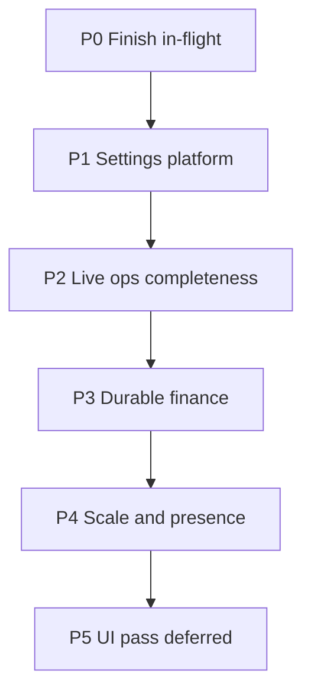

# Production feature full build-out

Date: 2026-09-07. Status: **approved** (owner: Settings **C**, horizon **everything**).
UI chrome polish is deferred until after P0–P2.

**Locked choices**

- **Settings C:** Edit non-secret `FS_CORP_*` and company ops from Settings (server-side). Secrets stay in host `secrets.env`; Settings shows configured/missing only.
- **Horizon 3:** Full long-horizon (ChatDev egress, second worker host, TailscaleKit, furnished HQ art, invoice/refunds).
- **UI chrome later** — but replace companion `window.prompt` forms where they block production use.

**Baseline at approval:** v0.3.53 on fs-dev; HQ Phases 1–8 done; companion scopes done.
Dispatch-recommend was the first P0 item (see sibling plan).

## Defaults (new settings)

| Setting | Default |
|---|---|
| `company_budget_cents` | `500000` ($5,000 simulated) |
| Dispatch budget presets | `[100, 300, 500, 1000, 5000]` |
| Rate limit auth / unauth / window | `120` / `60` / `60s` |
| `FS_CORP_SSE_IDLE_SEC` | `1` |
| `FS_CORP_DEFAULT_WORKER_RUNTIME` | `container` |
| `FS_CORP_GATEWAY_EGRESS` | `worker_nic` |
| `FS_CORP_WORKER_NIC_IP` | `192.168.4.101` |
| `FS_CORP_LAN_IP` / `FS_CORP_PUBLIC_URL` | `192.168.4.100` / `https://192.168.4.100` |
| `FS_CORP_MODEL_CENTS_PER_1K_TOKENS` | `0` until owner sets |
| `CHATDEV_ALLOW_CONTROL_PLANE` | unset/false |
| Pairing ticket TTL | `15` min |
| Idempotency retention | `7` days |
| Feed poll cadence | `3600` s |
| Model profiles | `mock-text` on; live off until keys present |

Secrets never appear in Settings payloads or logs.

## P0 — Finish in-flight

1. **Dispatch-recommend** — [2026-09-07-dispatch-recommend-autofill.md](2026-09-07-dispatch-recommend-autofill.md) (Tasks 1–5).
2. **M10 non-chrome:** idempotency prune (7d); model_profiles / benchmark_results read APIs + fixtures; replace companion `window.prompt` for inbox respond / escalate / enroll; honest M10-05 docs.
3. **LearningAdapter.fetch** — fail-closed HTTPS allowlist only.

## P1 — Settings platform (C)

Runtime SQLite overlay for hot-apply knobs; host-bound IPs read-only; secrets-status only.
APIs: `GET/PATCH /api/v1/settings`, `POST …/reset`, `GET …/secrets-status`.
Sections: Connection · Company · Models · Workers · Network · Intelligence · SLOs · Security · Advanced.

## P2 — Live ops completeness

Feeds/watchlists CRUD · billed pricing overlay · push/GitHub secret-status · controlled ChatDev worker egress · consultant M7.

## P3 — Durable finance and evidence

Invoice/refunds/period rollover · budget-period UX · optional `choose_model` benchmark use · work-order replay ledger.

## P4 — Scale and presence

Second worker host · TailscaleKit · furnished HQ room art · org hierarchy milestone 5 if needed.

## P5 — UI pass (later)

Cosmic-glass refresh, version chrome, HQ tile keyboard, marketing layout — after P0–P2.

## Governance

Owner root; Settings PATCH via CEO/admin companion scopes; no invented HQ state; each phase updates capability matrix, roadmap, decisions, handoff.

## Suggested sequencing after dispatch-recommend merge

1. M10-01/03 + LearningAdapter.fetch (+ companion prompt forms).
2. Spec/plan for Settings platform (P1).
3. Then ChatDev egress / second host / art / refunds.
