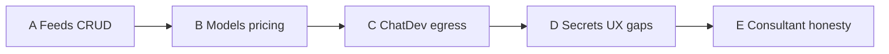

# Design: P2 Live ops completeness

Date: 2026-09-07. Status: **approved** (owner 2026-09-07). Plan: `docs/superpowers/plans/2026-09-07-p2-live-ops.md`.

## Goal

Complete production **P2 Live ops** after Settings platform (P1): operators can manage approved feed sources from the companion, see model pricing honestly, confirm push/GitHub secret status, and optionally enable **allowlisted HTTPS ChatDev worker egress** without opening unrestricted worker networking. Consultant M7 stays honest (cooldowns/status only; no invented before/after scores).

Owner choices locked in brainstorming:

| Topic | Choice |
|---|---|
| Packaging | One design + one plan; implement slices **A → B → C** (then D/E) without re-picking |
| Feeds vs watchlists | **Feed sources only**; `config/watchlists.example.json` remains non-live template |
| ChatDev egress | Opt-in **allowlisted HTTPS** destinations from a **host config file**; default remains `--network none` |
| Consultant M7 | Thin honesty/polish slice **E**, not fake efficiency metrics |

## Non-goals

- Persisted watchlist CRUD / auto-poll daemons.
- Writing secret values from Settings.
- Full open worker network or forwarding `CHATDEV_ALLOW_CONTROL_PLANE` into containers.
- Invoice/refunds / budget-period UX (P3).
- Second worker host, TailscaleKit, furnished HQ art (P4).
- UI chrome polish (P5).
- Desk Settings parity (companion first, same as P1).

## Slice map

| Slice | Deliverable |
|---|---|
| **A** | Pause/revoke feed sources; companion Feeds section; poll fails closed unless `approved` |
| **B** | Settings Models section; global cents overlay + read-only profiles; pricing resolution unchanged |
| **C** | Host allowlist file + egress mode; restricted worker path; status fields; fail closed |
| **D** | Fill any missing `SECRET_NAMES` / companion honesty after A–C |
| **E** | Surface consultant cooldown/status; docs match code |

## Architecture

### A — Feed sources

Reuse table `feed_sources` (`id`, `url`, `approved_by`, `approved_at`, `status`).

| Status | Meaning |
|---|---|
| `approved` | Eligible to poll |
| `paused` | Kept on file; poll denied until re-approved |
| `revoked` | Terminal-ish; re-approve via `POST /feeds` restores `approved` |

**APIs** (CEO principal / existing scopes: enroll for approve, `company.pause` for poll; pause/revoke use the same CEO gate as approve):

- `GET /api/v1/feeds` — list (unchanged shape; status values expand).
- `POST /api/v1/feeds` — approve or re-approve HTTPS URL (`payload.id`, `payload.url`).
- `POST /api/v1/feeds/{id}/pause` — set `paused`; event `feed.source_paused`.
- `POST /api/v1/feeds/{id}/revoke` — set `revoked`; event `feed.source_revoked`.
- `POST /api/v1/feeds/{id}/poll` — unchanged contract; requires `status=approved`.

No watchlist table. No migration unless constraints demand it (status is already free text).

### B — Models / billed pricing

No new tables. Effective token price remains:

1. Profile `cents_per_1k_tokens` when set on the invoked profile.
2. Else Settings/env `FS_CORP_MODEL_CENTS_PER_1K_TOKENS` (overlay wins per ADR-036).
3. Else `0` (audit row still written for live invokes).

**APIs:** existing `GET /api/v1/settings*` and `GET /api/v1/model-profiles`. No profile PATCH in P2 unless a blocking gap appears during implementation (prefer read-only profiles + editable global rate).

### C — Controlled ChatDev worker egress

| Knob | Store | Notes |
|---|---|---|
| `FS_CORP_CHATDEV_WORKER_EGRESS` | Settings catalog enum `none` \| `allowlist` (overlay → env → default) | Default `none`; editable like other non-secret knobs |
| Allowlist file | Host path via `FS_CORP_CHATDEV_EGRESS_ALLOWLIST_FILE` | Not SQLite overlay; not editable from phone |
| Example | `config/chatdev-egress-allowlist.example.json` | Documented HTTPS host/prefix entries |

Behavior:

- Default and misconfiguration: container workers keep `--network none`.
- Mode `allowlist` with valid non-empty file: worker may use a **restricted** network configuration suitable for HTTPS to allowlisted destinations only (implementation detail in plan: Docker network + userspace/gateway allowlist, or equivalent fail-closed proxy). Open `bridge` without enforcement is forbidden.
- Destinations not on allowlist → deny; no silent upgrade to full internet.
- Never forward host `CHATDEV_ALLOW_CONTROL_PLANE` into workers (existing rule).

**Status:** `GET /api/v1/chatdev/status` adds:

- `worker_egress_mode`
- `allowlist_configured` (bool)
- `allowlist_count` (int)
- `worker_egress_ready` (bool; true only when mode is allowlist and file valid)

Do not return secret material. API returns **count + configured** only in P2 (full allowlist host list stays on the host file; not exposed in companion payloads).

### D — Secrets status

Extend `SECRET_NAMES` in `company/settings_runtime.py` only if a production secret used on fs-dev is missing. Companion Secrets section already consumes `GET /api/v1/settings/secrets-status`. No value fields.

### E — Consultant M7 honesty

Expose or surface existing `consultant_reviews` cooldown fields where a read path already exists or a minimal `GET` is cheap; update docs so “measured before/after” is not claimed without live change evidence. No invented efficiency scores.

## Companion UX

| Area | Behavior |
|---|---|
| Settings → **Feeds** | List + approve (id, HTTPS URL) + pause + revoke + poll; no `window.prompt`; mutate controls gated by session scopes |
| Settings → **Models** | Editable global cents setting; read-only profile list |
| Settings → Secrets | Unchanged pattern; fill gaps in D |
| Diagnostics | ChatDev card shows egress mode / ready; feeds probe reflects paused/revoked honestly |

## Authority

- Owner remains root.
- Feed mutate / poll: existing CEO gates (`_ceo` / scopes already on routes).
- Settings PATCH: ADR-036 (`company.pause` + CEO or admin companion).
- Egress allowlist file: host filesystem only; install/deploy docs; not phone-writable.
- Fail closed for unknown scopes, bad URLs, missing allowlist, and non-approved feeds.

## Failure modes

| Case | Result |
|---|---|
| Non-HTTPS feed URL | 400 |
| Poll paused/revoked/missing | Denied / not approved |
| Egress `allowlist` + missing/empty/invalid file | Workers stay network-none; `worker_egress_ready=false` |
| Request outside allowlist | Deny at enforcement boundary |
| Unauthorized Settings/Models write | 403 |
| Secret in API/log | Forbidden (regression tests) |

## Testing

- **A:** approve → poll ok; pause → poll denied; revoke → poll denied; re-approve; companion client/source assertions.
- **B:** pricing resolution order; Models UI source assertions.
- **C:** default none; misconfigured allowlist refuses; allow/deny with fixtures; status fields; no unrestricted network on misconfig.
- **D/E:** secrets-status valueless; cooldown/status smoke if exposed.
- Companion `npm run build` after UI slices.
- Deploy to fs-dev when owner requests (each slice may merge to `main` independently).

## Docs / governance updates (on implement)

- `docs/16-api-contract.md`, `docs/09-market-intelligence.md`, `docs/24-mobile-companion.md`, ChatDev/worker docs, capability matrix, roadmap, `docs/18-handoff.md`.
- ADR for ChatDev allowlisted egress (new) when slice C lands.
- Mark watchlists as still template-only in market-intel docs.

## Acceptance (P2 complete)

1. Owner can approve, pause, revoke, and poll feeds from companion over HTTPS on fs-dev.
2. Models section shows global pricing overlay and profile list without secret leakage.
3. ChatDev status reports egress mode; with allowlist configured and mode on, restricted egress path is available; default install remains network-none.
4. Secrets status covers production secret names used on fs-dev.
5. Docs do not claim live watchlist CRUD or open worker internet or invented consultant efficiency gains.
