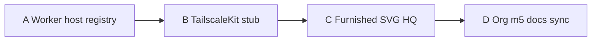

# Design: P4 Scale and presence (software-completeable)

Date: 2026-09-08. Status: **implemented** (v0.3.54).

## Goal

Complete production **P4** within what this repository can honestly ship without a second physical host, App Store TailscaleKit binaries, or photoreal art packs:

1. **Remote worker host registry** + heartbeat status (dispatch stays same-host).
2. **TailscaleKit** path documented and stubbed in `companion-native` (userspace VPN still future).
3. **Furnished HQ** as SVG furniture layers driven only by persisted room types.
4. **Org hierarchy m5** docs/capability honesty (cross-dept APIs already implemented).

Owner choices locked:

| Topic | Choice |
|---|---|
| P4 meaning | Software-completeable (A) |
| Worker hosts | CEO registry + heartbeat; **no remote execution** yet (A) |
| Packaging | Four slices in one plan |

## Non-goals

- Running containers on a remote host from this control plane.
- Embedding TailscaleKit / libtailscale and shipping store builds.
- Photoreal / purchased room art assets.
- Inventing HQ occupancy or worker presence.
- New org-chart supervisor tables.

## Slice map



## Slice A — Worker host registry

### Tables (Alembic `0027_worker_hosts`)

```sql
CREATE TABLE IF NOT EXISTS worker_hosts(
  id TEXT PRIMARY KEY,
  label TEXT NOT NULL,
  base_url TEXT NOT NULL,  -- https only
  enabled INTEGER NOT NULL,
  heartbeat_token_hash TEXT NOT NULL,
  last_heartbeat_at TEXT,
  last_heartbeat_meta TEXT,  -- JSON: version, runtime_ready, etc.
  created_at TEXT NOT NULL,
  created_by TEXT NOT NULL
);
```

### Behavior

- CEO creates host: generates opaque token once (return plaintext **only on create**); store hash.
- Heartbeat: `POST /api/v1/worker-hosts/{id}/heartbeat` with `Authorization: Bearer <host-token>` (or `X-Worker-Host-Token`); updates `last_heartbeat_at` + meta. No company scopes — token is the auth.
- Status: host is `ready` if enabled and heartbeat within TTL (default 120s, Settings/env `FS_CORP_WORKER_HOST_HEARTBEAT_TTL_SEC`); else `stale` / `disabled`.
- `GET /api/v1/workers/status` adds `remote_hosts: [{id, label, state, last_heartbeat_at, …}]` (never token).
- CEO list/enable/disable/delete via `/api/v1/worker-hosts*`.
- **Dispatch path unchanged** — still local subprocess/container. Docs state remote run is future once an agent exists.

### Events

`worker_host.created`, `worker_host.updated`, `worker_host.heartbeat`, `worker_host.disabled`.

## Slice B — TailscaleKit stub

- Add `companion-native/tailscale_kit.ts` exporting `isTailscaleKitAvailable(): false` and `joinWithAuthKey(_key): Promise<{ok:false, reason:"not_implemented"}>`.
- README section: TailscaleKit / userspace node is the future path when Apple/Google allow; current path remains clipboard + system Tailscale app.
- Do not add native binary dependencies.

## Slice C — Furnished HQ SVG

- Desk isometric (and plan view optionally): for each **built** room with a known `room_type` / department, draw small furniture glyphs (desk, table, server rack) as SVG groups **inside** the room polygon — deterministic from `room.id` + `room_type` only.
- Map a small catalog: e.g. `engineering` → workstation, `executive` → conference table, default → plant/desk.
- No furniture for unbuilt / provisional rooms beyond current rise animation.
- Respect `prefers-reduced-motion` (no extra animation required for static furniture).

## Slice D — Org m5 honesty

- Update `docs/superpowers/specs/2026-09-07-org-hierarchy-handoff-design.md` and roadmap/capability notes: cross-department requests are **implemented** (not deferred).
- No schema change unless a doc claims a missing API that still is missing (verify against `create_cross_dept_request`).

## Companion / desk UX

- Settings or Diagnostics: list remote worker hosts + state (companion optional thin; desk Diagnostics already probes workers — extend JSON).
- CEO desk or API-only create is enough for P4; companion form for register host if low cost.

## Authority

- Host CRUD: `_ceo` + `company.pause`.
- Heartbeat: host token only; fail closed on bad/missing token.
- Furniture: read-only projection of headquarters API.

## Testing

- A: create host returns token once; heartbeat ready within TTL; stale after TTL; status never leaks token; dispatch still local.
- B: source assertions on stub exports + README.
- C: desk source assertions for furniture group / room_type mapping; reduced-motion unchanged.
- D: doc assertions or manual checklist in plan.
- Full unittest + companion build if companion touched.

## Acceptance

1. Owner can register a remote host and see ready/stale from heartbeats without enabling remote dispatch.
2. Native README + stub make TailscaleKit status honest.
3. Built HQ rooms show type-based SVG furniture without inventing workers.
4. Docs no longer claim cross-dept m5 is deferred.
5. ADR-040 documents registry-without-remote-run.

## Follow-on (not P4)

Remote worker agent + enqueue; real TailscaleKit integration; artist-furnished packs.
