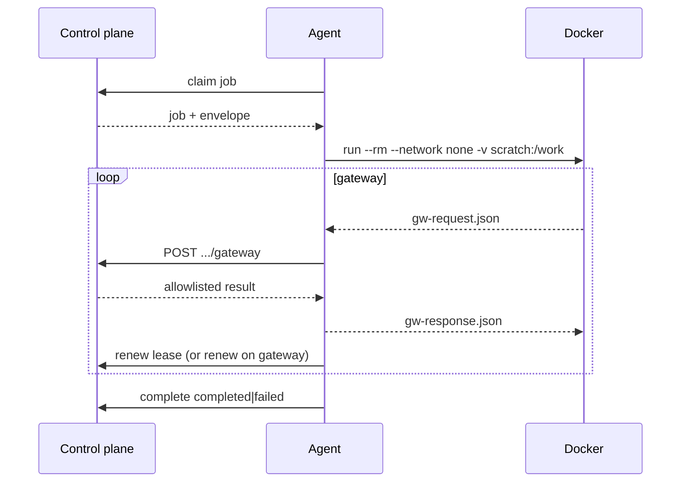

# Design: Remote container-on-agent (relayed gateway)

Date: 2026-09-08. Status: **implemented** (v0.3.58).

## Goal

Extend the remote pull agent so an **opt-in** host can run the same worker **container** shape as same-host isolation (`--network none` + scratch file gateway), while **relaying** allowlisted gateway ops to the control plane over the existing host token. Default agent behavior remains lease + mock-complete.

## Locks

| Topic | Choice |
|---|---|
| Depth | Container + relayed gateway (2) |
| Missing Docker/image (in container mode) | Fail job — complete `failed`; no mock fallback (A) |
| Container network | Always `--network none` this slice (A) |
| Activation | Agent env `FS_CORP_REMOTE_WORKER_RUNTIME=container`; default mock (A) |
| Approach | Claim embeds envelope; agent pumps scratch → HTTP gateway (1) |

## Non-goals

- Remote ChatDev egress / Docker networks other than `none`
- Control plane pushing or authenticating image registries
- Agent opening Company SQLite or importing control-plane packages as a service
- Changing same-host `dispatch-worker` defaults
- Inventing HQ occupancy / presence from agent heartbeats beyond existing host registry
- Track C (marketing layout)

## Flow

1. Enqueue / claim / list remain as in ADR-042 (plus auto placement when ADR-043 flag is on).
2. On claim, control plane adds `envelope` from `build_worker_envelope` (same shape as local workers).
3. If agent runtime ≠ `container` → existing mock-complete.
4. If `container`: require `docker` and configured image; otherwise `complete` with `failed` and a clear reason.
5. Agent writes envelope under local scratch, runs worker image with `--network none` and `/work` mount (same entrypoint flags as `ContainerWorkerRuntime`, no egress network args, never forward `CHATDEV_ALLOW_CONTROL_PLANE`).
6. Pump: read `gw-request.json` → `POST …/gateway` → write `gw-response.json`; extend lease; finish on `result.json` or non-zero docker exit → `complete`.

## APIs

| Method | Path | Auth | Notes |
|---|---|---|---|
| POST | `…/jobs/{job_id}/claim` | host token | Response adds `envelope` |
| POST | `…/jobs/{job_id}/gateway` | host token | Body = file-gateway message (`op` + args). Remote-only allowlist: `gateway_check`, `execute_mock`, `store_artifact`; `invoke_model` is denied. Require job `claimed`, valid lease, host match. Successful gateway **also renews** the lease when still claimed; if the claim is lost after an operation commits, return its successful reply without renewing. For `store_artifact`, ignore container-local `root`/`/work` paths; persist under the control-plane artifact root for that task (same as local parent). |
| POST | `…/jobs/{job_id}/renew` | host token | Extend `lease_expires_at` by `LEASE_SEC` (120s) without executing an op (idle stretch while container runs). |
| POST | `…/jobs/{job_id}/complete` | host token | Unchanged body. Container path records runtime `remote_container` only after Docker starts. Failed completion releases a non-cancelled queue lease for redispatch. |

No new Alembic revision: claim payload and routes only.

## Agent env

| Variable | Role |
|---|---|
| `FS_CORP_REMOTE_WORKER_RUNTIME` | `container` to enable; anything else → mock |
| `FS_CORP_WORKER_IMAGE` | Image name; default `fs-corporation-worker:local` |
| `FS_CORP_WORKER_SCRATCH` | Optional local scratch root; else temp dir |
| Existing | `FS_CORP_CONTROL_URL`, `FS_CORP_WORKER_HOST_ID`, token / token file |

## Authority and fail-closed

- Gateway and renew: host token only; path `host_id` must match token; job must belong to that host.
- Any remote op outside `gateway_check`, `execute_mock`, and `store_artifact` → deny.
- Gateway / complete after lease expiry → deny; agent should complete `failed` or let reclaim after expiry rules.
- Container mode without docker/image → `failed`, never silent mock.
- Mock agents do not call gateway routes.

## Testing

- Claim includes `envelope` keys aligned with `build_worker_envelope`.
- Gateway: allowed op succeeds; unknown op / wrong host / expired lease denied.
- Renew extends `lease_expires_at`.
- Agent tests with faked HTTP (and faked docker presence): mock path unchanged; container missing → failed complete.
- Prefer no mandatory live Docker in CI; optional integration if image already available.

## Acceptance

1. Default agent remains mock-complete.
2. Opt-in container path uses `--network none`, relayed allowlisted gateway, and fail-closed without docker/image.
3. ADR-044; version **0.3.58**; API contract + handoff; next track **C** marketing layout (after A ships).

## Out of band

- Branch: prefer `feature/remote-container-on-agent` from `main` (or from main after B merges if owner wants B first). Spec does not require merging B before A.
