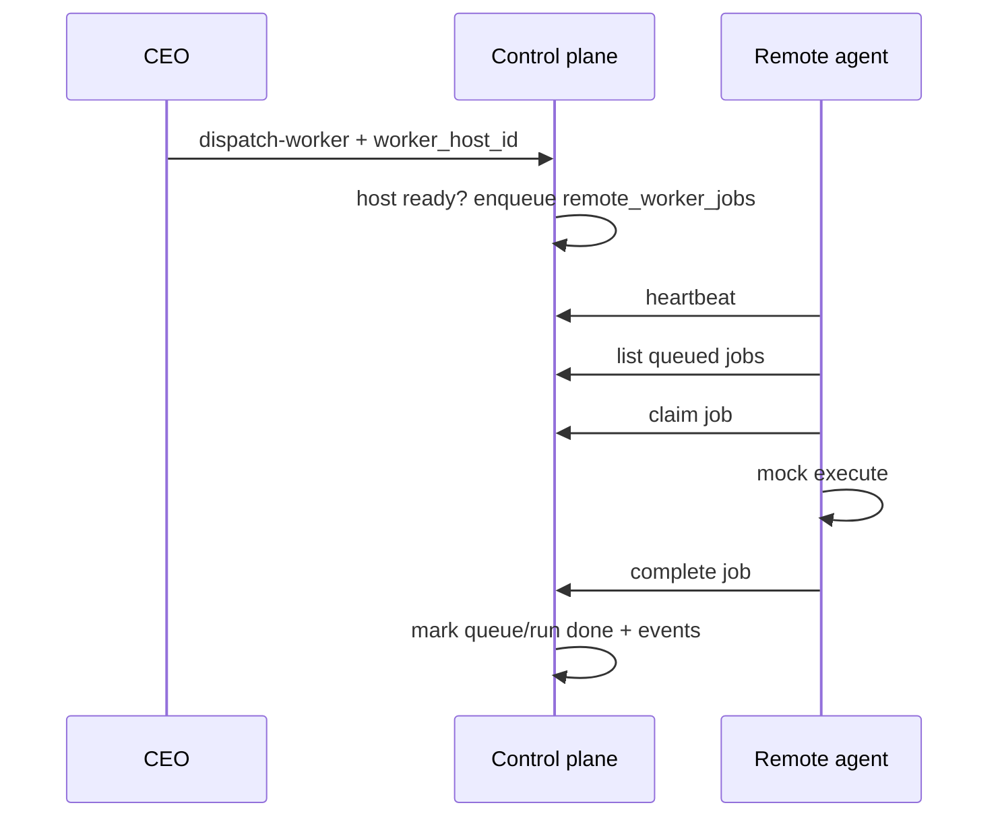

# Design: Remote worker pull agent (lease + mock)

Date: 2026-09-08. Status: **implemented** (v0.3.56).

## Goal

Enable **explicit** remote task execution via a **pull agent** on a registered worker host, without changing the default same-host dispatch path.

Owner locks:

| Topic | Choice |
|---|---|
| Delivery | Pull agent (A) |
| Routing | Explicit `worker_host_id` only (A) |
| Depth | Lease + mock complete (1) — no remote Docker in v1 |

## Non-goals

- Auto selection of remotes.
- Remote container / file-gateway runtime on the agent host.
- SSH / push enqueue into the remote.
- Inventing HQ occupancy or worker presence.
- Giving agents SQLite paths, owner tokens, or policy APIs.

## Flow



1. Authenticated actor calls `POST /api/v1/tasks/{task_id}/dispatch-worker` with `worker_host_id`.
2. Control plane requires that host `state == ready` (enabled + fresh heartbeat). Creates `remote_worker_jobs` row `queued`, records a `worker_runs` row with runtime `remote_agent` (or equivalent), emits events. Does **not** spawn local subprocess/container.
3. Omitting `worker_host_id` keeps today’s same-host isolated dispatch.
4. Agent authenticates with the host heartbeat token:
   - Continues existing heartbeat.
   - `GET /api/v1/worker-hosts/{host_id}/jobs` (queued for this host).
   - `POST /api/v1/worker-hosts/{host_id}/jobs/{job_id}/claim` → `claimed` + lease expiry.
   - Runs mock work locally (deterministic deliverable / status only — no control-plane DB).
   - `POST …/complete` with `{status: completed|failed, result: …}` → control plane finishes run, marks queue done when completed, emits `worker.finished` / `task.worker_completed` as appropriate.
5. Fail closed: unknown/disabled/stale host at enqueue; bad token; claim of non-queued job; complete without valid claim; lease expiry returns job to `queued` (or `failed` after max attempts — prefer requeue once then fail).

## Schema (Alembic `0028_remote_worker_jobs`)

```sql
CREATE TABLE IF NOT EXISTS remote_worker_jobs(
  id TEXT PRIMARY KEY,
  host_id TEXT NOT NULL,
  task_id TEXT NOT NULL,
  worker_run_id TEXT,
  status TEXT NOT NULL,
  lease_owner TEXT,
  lease_expires_at TEXT,
  attempts INTEGER NOT NULL,
  result_json TEXT,
  created_at TEXT NOT NULL,
  updated_at TEXT NOT NULL,
  created_by TEXT NOT NULL
);
```

Statuses: `queued` | `claimed` | `completed` | `failed` | `cancelled`.

## APIs

| Method | Path | Auth | Notes |
|---|---|---|---|
| POST | `/api/v1/tasks/{task_id}/dispatch-worker` | existing scopes | Optional `worker_host_id` in payload |
| GET | `/api/v1/worker-hosts/{id}/jobs` | host token | List `queued` (and optionally `claimed` by this lease) |
| POST | `/api/v1/worker-hosts/{id}/jobs/{job_id}/claim` | host token | Lease TTL default 120s |
| POST | `/api/v1/worker-hosts/{id}/jobs/{job_id}/complete` | host token | Body status + result |
| GET | `/api/v1/worker-hosts/{id}/jobs` (CEO) | company.read | Optional later; v1 agent-only list is enough |

Host-token routes never return heartbeat secrets. Job list never includes other hosts’ jobs.

## Agent

`scripts/remote_worker_agent.py`:

- Env: `FS_CORP_CONTROL_URL`, `FS_CORP_WORKER_HOST_ID`, `FS_CORP_WORKER_HOST_TOKEN` (or token file).
- Loop: heartbeat → poll jobs → claim → mock execute → complete; sleep with backoff.
- Exit non-zero on misconfig; log without printing full token.

## Authority

- Enqueue remote: same as today’s dispatch-worker (scoped + approvals as today) plus host readiness check.
- Claim/complete: host token only; host_id in path must match token’s host.
- Cancel remote job: CEO (optional in v1 if time; else leave job until lease expire/fail).

## Testing

- Enqueue without host → local path unchanged.
- Enqueue with ready host → job queued; no local runtime spawn.
- Stale/disabled host → 422/403 fail closed.
- Claim + complete happy path; double-claim fails; wrong token fails.
- Agent script: dry-run or unittest with TestClient + mocked sleep.
- Full unittest suite.

## Acceptance

1. Explicit `worker_host_id` enqueues a remote job only when host is ready.
2. Pull agent can claim and complete with host token; task reaches completed via control-plane events.
3. Default dispatch (no host id) remains same-host.
4. ADR-042 documents pull + explicit routing + mock-complete v1.
5. Docs/handoff updated; no invented operational state.

## Follow-on

Remote container + file gateway on agent; auto host placement; CEO job console in companion.
